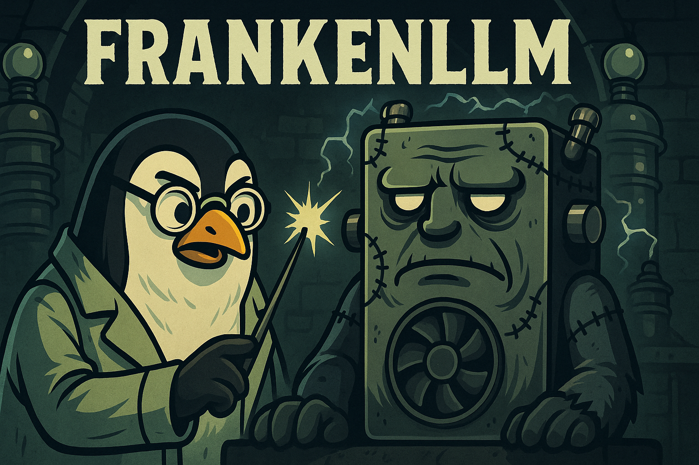

# 🧟 FrankenLLM

<div align="center">
  
</div>

**Stitched-together GPUs, but it lives!**

Run separate LLM models on each of your NVIDIA GPUs simultaneously. Perfect for multi-GPU setups where you want to maximize utilization.

```
    ⚡ GPU 0 (16GB) ━━━━┓
                        ┣━━━ FrankenLLM ━━━━ Multiple Models!
    ⚡ GPU 1 (8GB)  ━━━━┛
```

---

## ✨ Features

- 🎯 **Per-GPU Model Serving** - Run different models optimized for each GPU's VRAM
- 🚀 **Zero Interference** - Each GPU has its own Ollama instance on separate ports
- 🔧 **Easy Management** - Simple scripts for installation, service control, and testing
- 🌐 **Local & Remote** - Works on localhost or remote servers via SSH
- ⚙️ **Systemd Services** - Automatic startup, monitoring, and restart on failure
- 🔥 **Auto-Warmup** - Models automatically load into GPU memory on boot
- ⚡ **Configurable** - Support for 1+ GPUs with flexible model selection
- 🖥️ **Headless Ready** - Designed for Ubuntu Server 24.04 (tested with Linux 6.14 + NVIDIA 580 drivers)

---

## 📁 Project Structure

```
frankenllm/
├── install.sh              # 🚀 Main installer (auto-detects local/remote)
├── manage.sh               # 🎛️  Main service manager
├── configure.sh            # ⚙️  Configuration wizard
├── config.sh               # 📝 Configuration loader
├── .env.example            # 📋 Configuration template
│
├── bin/                    # 🔧 Core utilities
│   ├── check-gpus.sh       #    Check GPU configuration
│   ├── health-check.sh     #    Test service connectivity
│   ├── pull-model.sh       #    Pull same model on both GPUs
│   ├── pull-dual-models.sh #    Pull different models per GPU
│   ├── test-llm.sh         #    Test both LLMs with a query
│   ├── warmup-models.sh    #    Pre-load models into GPU memory
│   └── warmup-on-boot.sh   #    Auto-warmup service script
│
├── local/                  # 💻 Local installation scripts
│   ├── install.sh          #    Install on THIS machine
│   └── manage.sh           #    Manage local services
│
├── remote/                 # 🌐 Remote installation scripts
│   ├── install.sh          #    Install on remote server via SSH
│   ├── manage.sh           #    Manage remote services via SSH
│   └── setup-warmup.sh     #    Configure auto-warmup on remote
│
└── docs/                   # 📚 Complete documentation
    ├── README.md           #    Full documentation
    ├── CONFIGURATION.md    #    Configuration guide
    ├── AUTO_WARMUP.md      #    Auto-warmup setup
    ├── QUICKSTART.md       #    Quick command reference
    └── REMOTE_MANAGEMENT.md #   Remote server guide
```

---

## 🚀 Quick Start

### 1. Configure Your Environment

```bash
./configure.sh
```

This creates a `.env` file with:
- Server IP (localhost or remote IP like 192.168.201.145)
- GPU ports (default: 11434, 11435)
- GPU names (optional)

### 2. Install Ollama Services

```bash
./install.sh
```

Auto-detects local or remote from your configuration and:
- Installs Ollama
- Creates systemd services for each GPU
- Starts and enables services

### 3. Pull Models

```bash
# Pull different models optimized for each GPU
./bin/pull-dual-models.sh gemma3:12b gemma3:4b

# Or pull the same model on both
./bin/pull-model.sh gemma2:9b
```

### 4. Pre-warm Models (Optional but Recommended)

```bash
# Load models into GPU memory for instant responses
./bin/warmup-models.sh
```

> 💡 For automatic warmup on boot, see the [Auto-Warmup Guide](docs/AUTO_WARMUP.md)

### 5. Test Your Setup

```bash
./bin/health-check.sh
./bin/test-llm.sh "What is your purpose?"
```

---

## 📊 Recommended Models

### For 32GB+ GPU (e.g., RTX 4090, RTX 6000 Ada, A6000)

**Flagship Models:**
- `gemma3:27b` - ⭐ **Google's largest Gemma!** Multimodal, 128K context
- `llama3.1:70b-instruct-q4_0` - Meta's most capable (quantized to fit)
- `qwen2.5:32b` - Alibaba's powerful multilingual model
- `mixtral:8x7b` - Mixture of experts, excellent performance

**Coding Specialists:**
- `deepseek-coder:33b-instruct` - Top-tier code generation
- `codellama:34b` - Meta's code specialist

### For 24GB GPU (e.g., RTX 4090, RTX 3090, A5000)

**Premium Models:**
- `gemma3:27b` - ⭐ **FITS PERFECTLY!** Google's flagship multimodal
- `llama3.1:45b-instruct-q4_0` - High capability (quantized)
- `qwen2.5:14b` - Excellent reasoning and multilingual
- `deepseek-coder:33b-instruct-q4_0` - Professional code generation

**Balanced Options:**
- `mistral:22b` - Great all-rounder
- `solar:10.7b` - Efficient and powerful

### For 16GB GPU (e.g., RTX 5060 Ti, RTX 4060 Ti)

**Google Gemma 3 (Newest! March 2025):**
- `gemma3:12b` - ⭐ **PERFECT FIT!** Multimodal (text + images), 128K context
- `gemma2:9b` - Stable, excellent performance
- `gemma:7b` - Original Gemma

**Other Great Options:**
- `llama3.2` - Meta's latest
- `mistral:7b-instruct` - Great for instruction following
- `codellama:13b` - Coding specialist
- `deepseek-coder:6.7b` - Another excellent code model

### For 8GB GPU (e.g., RTX 3050, RTX 4060)

**Google Gemma 3 (Newest! March 2025):**
- `gemma3:4b` - ⭐ **PERFECT FIT!** Multimodal, great capability/memory balance
- `gemma3:1b` - Ultra-fast responses
- `gemma2:2b` - Stable, best quality for 8GB
- `gemma:2b` - Original, still excellent

**Other Great Options:**
- `llama3.2:3b` - Compact but capable
- `phi3:3.8b` - Microsoft's efficient model
- `qwen:4b` - Strong multilingual model

### 🎯 Recommended Combos

**High-End Setup (32GB + 24GB):**
```bash
./bin/pull-dual-models.sh llama3.1:70b-instruct-q4_0 gemma3:27b
```

**Premium Dual 24GB:**
```bash
./bin/pull-dual-models.sh gemma3:27b qwen2.5:14b
```

**All Gemma 3 (16GB + 8GB):**
```bash
./bin/pull-dual-models.sh gemma3:12b gemma3:4b
```

**Fast Combo (16GB + 8GB):**
```bash
./bin/pull-dual-models.sh gemma3:12b gemma3:1b
```

**Stable Gemma 2:**
```bash
./bin/pull-dual-models.sh gemma2:9b gemma2:2b
```

**Code + General:**
```bash
./bin/pull-dual-models.sh codellama:13b llama3.2:3b
```

**Three GPU Setup (24GB + 16GB + 8GB):**
```bash
./bin/pull-dual-models.sh gemma3:27b gemma3:12b gemma3:4b
```

---

## 🎮 Usage

### Service Management

```bash
# Check status
./manage.sh status

# Start/stop/restart services
./manage.sh start
./manage.sh stop
./manage.sh restart

# View logs
./manage.sh logs

# Enable/disable auto-start on boot
./manage.sh enable
./manage.sh disable
```

### Health Monitoring

```bash
# Quick health check (no sudo required)
./bin/health-check.sh

# Detailed GPU information
./bin/check-gpus.sh
```

### Using the APIs

**GPU 0 (Port 11434):**
```bash
# List models
curl http://YOUR_IP:11434/api/tags

# Generate response
curl http://YOUR_IP:11434/api/generate -d '{
  "model": "gemma3:12b",
  "prompt": "Explain quantum computing",
  "stream": false
}'
```

**GPU 1 (Port 11435):**
```bash
# List models
curl http://YOUR_IP:11435/api/tags

# Generate response
curl http://YOUR_IP:11435/api/generate -d '{
  "model": "gemma3:4b",
  "prompt": "Write a Python function",
  "stream": false
}'
```

---

## ⚙️ Configuration

Configuration is stored in `.env` (create from `.env.example`):

```bash
# Server Configuration
FRANKEN_SERVER_IP=192.168.201.145    # or "localhost" for local
FRANKEN_INSTALL_DIR=/opt/frankenllm

# GPU Configuration
FRANKEN_GPU_COUNT=2                  # Number of GPUs (1 or more)

# Port Configuration
FRANKEN_GPU0_PORT=11434
FRANKEN_GPU1_PORT=11435

# GPU Names (optional, for display)
FRANKEN_GPU0_NAME="RTX 5060 Ti"
FRANKEN_GPU1_NAME="RTX 3050"

# Model Configuration
# Specify which models to use on each GPU
FRANKEN_GPU0_MODEL="gemma3:12b"
FRANKEN_GPU1_MODEL="gemma3:4b"
```

Run `./configure.sh` for an interactive setup wizard that will guide you through all options.

### Customizing for Your Setup

The configuration is flexible and supports:
- **1 or more GPUs**: Set `FRANKEN_GPU_COUNT` to match your hardware
- **Custom models**: Choose any Ollama-compatible model for each GPU
- **Different GPU sizes**: Optimize model selection based on VRAM
- **Local or remote**: Works on localhost or over SSH

Example configurations:

**Single GPU Setup:**
```bash
FRANKEN_GPU_COUNT=1
FRANKEN_GPU0_MODEL="gemma3:12b"
```

**Different Model Families:**
```bash
FRANKEN_GPU0_MODEL="llama3.2"      # Meta's Llama on GPU 0
FRANKEN_GPU1_MODEL="mistral:7b"    # Mistral on GPU 1
```

**Code-focused Setup:**
```bash
FRANKEN_GPU0_MODEL="codellama:13b"
FRANKEN_GPU1_MODEL="deepseek-coder:6.7b"
```

---

## 🔍 Troubleshooting

### Services won't start

```bash
# Check service status
./manage.sh status

# View logs
./manage.sh logs

# Manually check systemd
ssh YOUR_SERVER  # if remote
sudo systemctl status ollama-gpu0
sudo systemctl status ollama-gpu1
```

### Slow first response / health check lag

**Problem**: First API call is slow (10-30 seconds), or queries become slow after a few minutes of inactivity.

**Cause**: 
1. Models aren't loaded into GPU memory yet (first call triggers loading)
2. Ollama unloads idle models after 5 minutes by default

**Solution**: 

**Step 1 - Enable Keep-Alive** (keeps models loaded indefinitely):

```bash
# For existing installations
./bin/enable-keep-alive.sh

# New installations (v1.1.0+) have this enabled automatically
```

**Step 2 - Warmup Models** (loads models into memory):

```bash
./bin/warmup-models.sh
```

For automatic warmup on boot, see [Auto-Warmup Guide](docs/AUTO_WARMUP.md).

> 💡 **Why both?** Keep-alive prevents unloading, warmup loads models on boot. Together they ensure instant responses 24/7.

### Models not responding

```bash
# Verify services are online
./bin/health-check.sh

# Check if models are installed
curl http://YOUR_IP:11434/api/tags
curl http://YOUR_IP:11435/api/tags

# Warm up models
./bin/warmup-models.sh

# Restart services if needed
./manage.sh restart
```

### Out of memory errors

- Use smaller models for 8GB GPU (4b or smaller)
- Reduce context window size in your API calls
- Consider using quantized versions

---

## 📚 Why Gemma 3?

**Google Gemma 3** (Released March 2025) offers:
- 🖼️ **Multimodal**: Can process both text AND images (4B, 12B, 27B sizes)
- 📏 **128K Context**: Massive context window for large documents
- ⚡ **Efficient**: Sliding window attention for better performance
- 🎯 **Perfect Sizes**: 4B fits 8GB, 12B fits 16GB perfectly
- 🆓 **Open Weights**: Commercial-friendly license

Available sizes: 270M, 1B, **4B**, **12B**, 27B

---

## 🤝 Contributing

Found a bug? Want to add a feature? PRs welcome!

### Contribution Guidelines

- Follow clean code practices and shell scripting best practices
- Test your changes on both local and remote setups
- Add comments to complex logic
- Update relevant documentation in `docs/`
- Ensure scripts are executable and have proper shebangs
- Test with different GPU configurations when possible

---

## 📚 Documentation

Complete documentation is available in the [`docs/`](docs/) directory:

### Core Guides

- **[Configuration Guide](docs/CONFIGURATION.md)** - ⚙️ Complete configuration reference with examples
- **[Auto-Warmup Setup](docs/AUTO_WARMUP.md)** - 🔥 Keep models loaded and ready on boot
- **[Remote Management](docs/REMOTE_MANAGEMENT.md)** - 🌐 SSH and remote server setup
- **[Quick Start](docs/QUICKSTART.md)** - ⚡ Fast command reference

### Additional Resources

- **[Full README](docs/README.md)** - Complete documentation with all features
- **[Issues Resolved](docs/ISSUES_RESOLVED.md)** - Troubleshooting guide
- **[Setup Complete](docs/SETUP_COMPLETE.md)** - Post-installation reference
- **[Reorganization Notes](docs/REORGANIZATION.md)** - Project structure details

### Quick Links

- 🚀 **[Getting Started](#-quick-start)**
- 🎯 **[Recommended Models](#-recommended-models)**
- 🎮 **[Usage Guide](#-usage)**
- 🔧 **[Configuration](#️-configuration)**
- 🔍 **[Troubleshooting](#-troubleshooting)**

---

## 🆘 Support

If you encounter any issues or have questions:

1. **Check Documentation**: Review the docs in [`docs/`](docs/) directory
2. **GPU Detection**: Run `./bin/check-gpus.sh` to verify GPU configuration
3. **Health Check**: Use `./bin/health-check.sh` to verify services are online
4. **Service Logs**: Check logs with `./manage.sh logs` (external terminal)
5. **Model Issues**: Run `./bin/warmup-models.sh` to pre-load correct models
6. **SSH Problems**: See [Remote Management Guide](docs/REMOTE_MANAGEMENT.md)
7. **Open an Issue**: If problems persist, [open a GitHub issue](https://github.com/ChiefGyk3D/FrankenLLM/issues)

---

## 📜 License

This Source Code Form is subject to the terms of the Mozilla Public License, v. 2.0.
If a copy of the MPL was not distributed with this file, You can obtain one at https://mozilla.org/MPL/2.0/.

SPDX-License-Identifier: MPL-2.0

---

## 🙏 Credits

- Built on [Ollama](https://ollama.com/)
- Inspired by the need to utilize all available GPU resources
- Named after Frankenstein's monster: stitched together from parts, but it works!

---

## 💝 Donations and Tips

If you find FrankenLLM useful, consider supporting development:

**Donate**:

<div align="center">
  <table>
    <tr>
      <td align="center"><a href="https://patreon.com/chiefgyk3d?utm_medium=unknown&utm_source=join_link&utm_campaign=creatorshare_creator&utm_content=copyLink" title="Patreon"></a></td>
      <td align="center"><a href="https://streamelements.com/chiefgyk3d/tip" title="StreamElements"></a></td>
    </tr>
    <tr>
      <td align="center">Patreon</td>
      <td align="center">StreamElements</td>
    </tr>
  </table>
</div>

### Cryptocurrency Tips

<div align="center">
  <table style="border:none;">
    <tr>
      <td align="center" style="padding:8px; min-width:120px;">
        
      </td>
      <td align="left" style="padding:8px;">
        <b>Bitcoin</b><br/>
        <code style="font-size:12px;">bc1qztdzcy2wyavj2tsuandu4p0tcklzttvdnzalla</code>
      </td>
    </tr>
    <tr>
      <td align="center" style="padding:8px; min-width:120px;">
        
      </td>
      <td align="left" style="padding:8px;">
        <b>Monero</b><br/>
        <code style="font-size:12px;">84Y34QubRwQYK2HNviezeH9r6aRcPvgWmKtDkN3EwiuVbp6sNLhm9ffRgs6BA9X1n9jY7wEN16ZEpiEngZbecXseUrW8SeQ</code>
      </td>
    </tr>
    <tr>
      <td align="center" style="padding:8px; min-width:120px;">
        
      </td>
      <td align="left" style="padding:8px;">
        <b>Ethereum</b><br/>
        <code style="font-size:12px;">0x554f18cfB684889c3A60219BDBE7b050C39335ED</code>
      </td>
    </tr>
  </table>
</div>

---

<div align="center">

Made with ❤️ by [ChiefGyk3D](https://github.com/ChiefGyk3D)

## Author & Socials

<table>
  <tr>
    <td align="center"><a href="https://social.chiefgyk3d.com/@chiefgyk3d" title="Mastodon"></a></td>
    <td align="center"><a href="https://bsky.app/profile/chiefgyk3d.com" title="Bluesky"></a></td>
    <td align="center"><a href="http://twitch.tv/chiefgyk3d" title="Twitch"></a></td>
    <td align="center"><a href="https://www.youtube.com/channel/UCvFY4KyqVBuYd7JAl3NRyiQ" title="YouTube"></a></td>
    <td align="center"><a href="https://kick.com/chiefgyk3d" title="Kick"></a></td>
    <td align="center"><a href="https://www.tiktok.com/@chiefgyk3d" title="TikTok"></a></td>
    <td align="center"><a href="https://discord.chiefgyk3d.com" title="Discord"></a></td>
    <td align="center"><a href="https://matrix-invite.chiefgyk3d.com" title="Matrix"></a></td>
  </tr>
  <tr>
    <td align="center">Mastodon</td>
    <td align="center">Bluesky</td>
    <td align="center">Twitch</td>
    <td align="center">YouTube</td>
    <td align="center">Kick</td>
    <td align="center">TikTok</td>
    <td align="center">Discord</td>
    <td align="center">Matrix</td>
  </tr>
</table>

</div>
